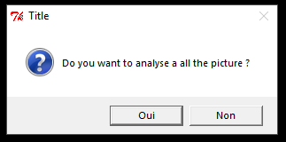

Transform pdf content
=====================

Description
-----------

Avec analyse_text_img, convertissez un tableau ou un texte sous format pdf ou image en un tableau Excel ou en un fichier html ou txt

Fonctionnalités
---------------

Cette version est un prototype qui ne fonctionne que partiellement mais surtout avec les images en annexe dans le dossier img.

Interface
---------

Lors du lancement du code, un choix l'utilisateur à la possibilité d'analyser un texte, un tableau ou rien (s'il répond 2x non) :

    

Après avoir choisi ce que vous vouliez analyser, une fenêtre s'ouvre pour aller chercher le fichier à analyser.

Ce peut être un fichier pdf qui sera automatiquement transformer en image ou une image directement:
    
Le fichier choisi peut être analyser dans sa totalité:

Si ce n'est pas le cas l'image s'affiche et il faut cliquer deux fois sur l'image pour encadrer tout le contenu à analyser:

    
Une fois ces opérations terminées, le script analyse l'image et renvoi un texte en ".txt" si vous aviez choisis un texte, sinon un tableau ".xlsx". 

Une dernière fenètre s'ouvre pour que vous choisissiez le dossier de destination du nouveau fichier créé:

Dépendances
-----------

Cette application interagit avec un script python. 
Python 2.7 doit être installé.

Son installation est décrite dans la section "Installation" ci-dessous

Python utilise les packages suivants (déjà contenus dans le code, des installations sont necessaries ):

* ``xml.dom``

* ``PIL``

* ``pylab,`` 

* ``tkMessageBox``  

* ``os,``

* ``scipy.ndimage,``

* ``xlwt,``

* ``Tkinter,``

* ``tkFileDialog,``  

* ``subprocess,`` 

Installation (Windows)
----------------------

- Python 2.7

    Allez sur https://www.python.org/downloads/ et suivez l'aide d'installation.
    
Site utilisé pour interagir avec mon script python, les installation sont décrite ci-dessous: 

http://documentation.veremes.net/public/veremap.pro/installation/ImageMagick/ImageMagick-win.html

https://github.com/tesseract-ocr/tesseract/wiki/Downloads

https://github.com/tesseract-ocr/tessdata

Auteurs
-------

Cette application a été créée par Xavier BARROS dans le cadre du séminaire de Publication Numérique sous la supervision d'Isaac PANTE lors du semestre d'automne 2017 à l'UNIL (Université de Lausanne).
